# 🗄️ Tech ABC Corp — HR Database

> **Enterprise PostgreSQL 15 Human Resources Database**  
> Replacing a shared Excel spreadsheet with a secure, normalized, ACID-compliant relational database for a 200-person multi-location technology company.

---

## 📋 Table of Contents

- [Project Overview](#-project-overview)
- [Business Scenario](#-business-scenario)
- [Dataset](#-dataset)
- [Database Design](#-database-design)
  - [Normalization (3NF)](#normalization-3nf)
  - [Schema — Tables](#schema--tables)
  - [Views](#views)
  - [Stored Procedure / Function](#stored-procedure--function)
- [Architecture](#️-architecture)
  - [Data Science Flow Diagram](#data-science-flow-diagram)
  - [Security Architecture](#security-architecture)
  - [Scalability](#scalability)
- [Getting Started](#-getting-started)
  - [Prerequisites](#prerequisites)
  - [Installation](#installation)
  - [Running the ETL](#running-the-etl)
- [CRUD Operations](#-crud-operations)
- [User Security](#-user-security)
- [Project Files](#-project-files)
- [Key Design Decisions](#-key-design-decisions)
- [Compliance & Retention](#-compliance--retention)
- [Future Roadmap](#-future-roadmap)
- [References](#-references)

---

## 🎯 Project Overview

| Attribute | Value |
|-----------|-------|
| **Company** | Tech ABC Corp |
| **Product** | WOPR (AI-Powered Video Game Console) |
| **Database** | `techabc_hr` |
| **Engine** | PostgreSQL 15 |
| **Schema** | 3rd Normal Form (3NF) |
| **Tables** | 6 |
| **Views** | 3 |
| **Functions** | 1 |
| **Employees** | 199 current + 6 historical records |
| **Locations** | 5 (Dallas, NYC, San Francisco, Minneapolis, Nashville) |
| **Status** | ✅ Production-Ready |

---

## 🏢 Business Scenario

Tech ABC Corp's **WOPR AI gaming console** achieved extraordinary commercial success, driving headcount from **10 → 200 employees in 6 months** — with a committed **20% year-over-year growth target** for the next 5 years (projecting ~497 employees by 2031).

This rapid expansion exposed critical weaknesses in the HR department's Excel-based record keeping:

| Risk | Impact | Resolution |
|------|--------|------------|
| 🔓 No salary access control | Any file recipient sees all compensation | Column-level `REVOKE` on `salary` |
| 💥 Concurrent edit corruption | Multiple users overwrite each other's changes | ACID-compliant RDBMS transactions |
| 📋 No data validation | Free-text fields allow any value | FK constraints + UNIQUE lookups |
| 🗂️ No audit trail | No record of who changed what | Transactional write log |
| 💾 No backup policy | Single file — no disaster recovery | Critical-tier: full weekly + daily incremental |
| ⚖️ No retention enforcement | Federal 7-year requirement unenforceable | Soft-delete via `end_dt`; records never deleted |

### Company Locations

| Office | City | State | Employees |
|--------|------|-------|-----------|
| HQ | Dallas | TX | 56 |
| East Coast | New York City | NY | 57 |
| West Coast | San Francisco | CA | 29 |
| Midwest | Minneapolis | MN | 31 |
| South | Nashville | TN | 32 |

---

## 📊 Dataset

**Source file:** `hr-dataset.xlsx` — 205 rows × 15 columns (199 current + 6 historical employee records)

### Dataset Statistics

| Metric | Value |
|--------|-------|
| Unique Employees | 199 |
| Total Rows (incl. history) | 205 |
| Historical Position Records | 6 |
| Departments | 5 |
| Job Titles | 10 |
| Office Locations | 5 |
| Education Levels | 7 |
| Hire Date Range | 1995 – 2020 |
| Min Salary | $26,050 |
| Max Salary | $540,000 |
| Avg Salary | $109,114 |

### Workforce by Department

| Department | Employees | % of Workforce | Avg Salary |
|------------|-----------|----------------|------------|
| Product Development | 69 | 34.7% | $111,054 |
| IT | 52 | 26.1% | $101,804 |
| Sales | 40 | 20.1% | $141,124 |
| Distribution | 25 | 12.6% | $60,489 |
| HQ | 13 | 6.5% | $123,069 |

### Job Title Distribution

| Title | Count | Title | Count |
|-------|-------|-------|-------|
| Sales Rep | 63 | Network Engineer | 24 |
| Administrative Assistant | 30 | Legal Counsel | 18 |
| Software Engineer | 28 | Shipping & Receiving | 17 |
| Design Engineer | 12 | Database Administrator | 8 |
| Manager | 4 | President | 1 |

### Original Excel Schema (15 Columns)

```
EMP_ID | EMP_NM | EMAIL | HIRE_DT | JOB_TITLE | SALARY | DEPARTMENT |
MANAGER | START_DT | END_DT | LOCATION | ADDRESS | CITY | STATE | EDUCATION LEVEL
```

### Data Quality Issues Resolved

| Issue | Field | Fix Applied |
|-------|-------|-------------|
| `#N/A` used instead of NULL | `MANAGER` | Stored as `NULL` in `manager_nm` |
| "Minnapolis" misspelling | `CITY` | Corrected to "Minneapolis" in lookup table |
| Salary mixed with non-sensitive data | `SALARY` | Moved to isolated `employee_job_history` table |
| Free-text departments/titles | `DEPARTMENT`, `JOB_TITLE` | Normalized to lookup tables with `UNIQUE` constraints |
| Historical records mixed with current | `END_DT` | Separated into `employee_job_history`; `NULL end_dt` = active |

---

## 🗃️ Database Design

### Normalization (3NF)

The flat Excel file violated all three normal forms. The resolution at each level:

**1NF → Atomic values:** Repeating free-text values for `DEPARTMENT`, `JOB_TITLE`, `LOCATION`, and `EDUCATION LEVEL` normalized into dedicated lookup tables with surrogate keys.

**2NF → Full functional dependency:** `SALARY`, `START_DT`, and `END_DT` depend on *(employee + time period)*, not employee alone. Moved to `employee_job_history`.

**3NF → No transitive dependencies:** `CITY`/`STATE` depend on `LOCATION` (not `EMP_ID`). `EDU_LEVEL` text depends on `EDU_ID` (not `EMP_ID`). Both extracted to lookup tables.

---

### Schema — Tables

#### Lookup Tables (Reference Data)

```sql
-- department
CREATE TABLE department (
    dept_id  SERIAL      NOT NULL,
    dept_nm  VARCHAR(50) NOT NULL,
    CONSTRAINT pk_department PRIMARY KEY (dept_id),
    CONSTRAINT uq_dept_nm   UNIQUE (dept_nm)
);

-- job_title
CREATE TABLE job_title (
    title_id  SERIAL       NOT NULL,
    title_nm  VARCHAR(100) NOT NULL,
    CONSTRAINT pk_job_title PRIMARY KEY (title_id),
    CONSTRAINT uq_title_nm  UNIQUE (title_nm)
);

-- location
CREATE TABLE location (
    location_id  SERIAL      NOT NULL,
    location_nm  VARCHAR(50) NOT NULL,
    city         VARCHAR(50) NOT NULL,
    state        CHAR(2)     NOT NULL,
    CONSTRAINT pk_location    PRIMARY KEY (location_id),
    CONSTRAINT uq_location_nm UNIQUE (location_nm)
);

-- education_level
CREATE TABLE education_level (
    edu_id    SERIAL      NOT NULL,
    edu_level VARCHAR(50) NOT NULL,
    CONSTRAINT pk_education_level PRIMARY KEY (edu_id),
    CONSTRAINT uq_edu_level       UNIQUE (edu_level)
);
```

#### Core Table

```sql
CREATE TABLE employee (
    emp_id      VARCHAR(10)  NOT NULL,   -- Natural key: E##### format
    emp_nm      VARCHAR(100) NOT NULL,
    email       VARCHAR(150) NOT NULL,
    hire_dt     DATE         NOT NULL,
    dept_id     INT          NOT NULL,   -- FK → department
    manager_nm  VARCHAR(100)     NULL,
    location_id INT          NOT NULL,   -- FK → location
    address     VARCHAR(150)     NULL,
    city        VARCHAR(50)      NULL,
    state       CHAR(2)          NULL,
    edu_id      INT              NULL,   -- FK → education_level
    CONSTRAINT pk_employee PRIMARY KEY (emp_id)
);
```

#### Job History Table *(salary isolated here for column-level security)*

```sql
CREATE TABLE employee_job_history (
    history_id  SERIAL        NOT NULL,
    emp_id      VARCHAR(10)   NOT NULL,   -- FK → employee
    title_id    INT           NOT NULL,   -- FK → job_title
    salary      NUMERIC(10,2) NOT NULL,   -- 🔒 RESTRICTED
    start_dt    DATE          NOT NULL,
    end_dt      DATE              NULL,   -- NULL = currently active
    CONSTRAINT pk_emp_job_history PRIMARY KEY (history_id)
);
```

#### Foreign Key Constraints

```sql
ALTER TABLE employee ADD CONSTRAINT fk_emp_dept
    FOREIGN KEY (dept_id)     REFERENCES department(dept_id);
ALTER TABLE employee ADD CONSTRAINT fk_emp_location
    FOREIGN KEY (location_id) REFERENCES location(location_id);
ALTER TABLE employee ADD CONSTRAINT fk_emp_edu
    FOREIGN KEY (edu_id)      REFERENCES education_level(edu_id);

ALTER TABLE employee_job_history ADD CONSTRAINT fk_history_emp
    FOREIGN KEY (emp_id)   REFERENCES employee(emp_id);
ALTER TABLE employee_job_history ADD CONSTRAINT fk_history_title
    FOREIGN KEY (title_id) REFERENCES job_title(title_id);
```

#### Physical ERD — Crow's Foot Cardinality

```
department       (1) ──────< (N) employee
location         (1) ──────< (N) employee
education_level  (1) ──────< (N) employee        [optional / nullable]
employee         (1) ══════< (N) employee_job_history
job_title        (1) ──────< (N) employee_job_history
```

---

### Views

| View | Access | Description |
|------|--------|-------------|
| `vw_employee_public` | All domain users | All employee attributes **excluding** salary. Primary access path for ~90% of users. |
| `vw_employee_full` | HR & Management only | All employee attributes **including** salary. Restricted via `GRANT`. |
| `vw_excel_replica` | HR & Management only | Reconstructs all 15 original Excel columns in original column order. Returns 205 rows (current + historical). |

#### `vw_employee_public` — No Salary

```sql
CREATE OR REPLACE VIEW vw_employee_public AS
SELECT
    e.emp_id,  e.emp_nm,  e.email,  e.hire_dt,
    jt.title_nm   AS job_title,
    d.dept_nm     AS department,
    e.manager_nm,
    l.location_nm AS location,
    edu.edu_level AS education_level
FROM employee e
JOIN department d              ON e.dept_id     = d.dept_id
JOIN location l                ON e.location_id = l.location_id
LEFT JOIN education_level edu  ON e.edu_id      = edu.edu_id
JOIN employee_job_history h    ON e.emp_id      = h.emp_id
    AND h.end_dt IS NULL
JOIN job_title jt              ON h.title_id    = jt.title_id;
```

#### `vw_excel_replica` — Full 15-Column Reconstruction

```sql
CREATE OR REPLACE VIEW vw_excel_replica AS
SELECT
    e.emp_id        AS "EMP_ID",
    e.emp_nm        AS "EMP_NM",
    e.email         AS "EMAIL",
    e.hire_dt       AS "HIRE_DT",
    jt.title_nm     AS "JOB_TITLE",
    h.salary        AS "SALARY",          -- included for HR audit use
    d.dept_nm       AS "DEPARTMENT",
    e.manager_nm    AS "MANAGER",
    h.start_dt      AS "START_DT",
    h.end_dt        AS "END_DT",
    l.location_nm   AS "LOCATION",
    e.address       AS "ADDRESS",
    e.city          AS "CITY",
    e.state         AS "STATE",
    edu.edu_level   AS "EDUCATION LEVEL"
FROM employee e
JOIN department d              ON e.dept_id     = d.dept_id
JOIN location l                ON e.location_id = l.location_id
LEFT JOIN education_level edu  ON e.edu_id      = edu.edu_id
JOIN employee_job_history h    ON e.emp_id      = h.emp_id   -- all rows, no end_dt filter
JOIN job_title jt              ON h.title_id    = jt.title_id
ORDER BY e.emp_id, h.start_dt;
```

---

### Stored Procedure / Function

PostgreSQL uses `RETURNS TABLE` functions in PL/pgSQL as the equivalent of a SQL Server stored procedure returning a result set.

```sql
CREATE OR REPLACE FUNCTION sp_get_employee_job_history(
    p_emp_nm VARCHAR(100)
)
RETURNS TABLE (
    employee_name   VARCHAR(100),
    job_title       VARCHAR(100),
    department      VARCHAR(50),
    manager_name    VARCHAR(100),
    start_date      DATE,
    end_date        DATE,
    position_status TEXT
)
LANGUAGE plpgsql AS $$
BEGIN
    RETURN QUERY
    SELECT
        e.emp_nm,
        jt.title_nm,
        d.dept_nm,
        e.manager_nm,
        h.start_dt,
        h.end_dt,
        CASE WHEN h.end_dt IS NULL THEN 'Current' ELSE 'Past' END::TEXT
    FROM employee e
    JOIN employee_job_history h ON e.emp_id   = h.emp_id
    JOIN job_title jt           ON h.title_id = jt.title_id
    JOIN department d           ON e.dept_id  = d.dept_id
    WHERE e.emp_nm ILIKE p_emp_nm          -- case-insensitive; supports wildcards
    ORDER BY h.start_dt;

    IF NOT FOUND THEN
        RAISE NOTICE 'No employee found matching: %', p_emp_nm;
    END IF;
END; $$;
```

**Usage:**
```sql
-- Exact match
SELECT * FROM sp_get_employee_job_history('Toni Lembeck');

-- Wildcard / partial match
SELECT * FROM sp_get_employee_job_history('%Lembeck%');
```

**Example output for Toni Lembeck:**

| employee_name | job_title | department | manager_name | start_date | end_date | position_status |
|--------------|-----------|------------|--------------|------------|----------|-----------------|
| Toni Lembeck | Network Engineer | IT | Jacob Lauber | 1995-03-12 | 2001-07-17 | Past |
| Toni Lembeck | Database Administrator | IT | Jacob Lauber | 2001-07-18 | *null* | Current |

---

## 🏛️ Architecture

### Data Science Flow Diagram

```mermaid
%%{init: {
  "theme": "base",
  "themeVariables": {
    "primaryColor":       "#1e3a5f",
    "primaryTextColor":   "#ffffff",
    "primaryBorderColor": "#0d2137",
    "lineColor":          "#64748b",
    "background":         "#f8fafc",
    "mainBkg":            "#f8fafc",
    "nodeBorder":         "#334155",
    "clusterBkg":         "#f1f5f9",
    "titleColor":         "#1e293b",
    "edgeLabelBackground":"#f8fafc",
    "fontFamily":         "ui-monospace, monospace"
  }
}}%%

flowchart TD
    %% ── SOURCE LAYER ──────────────────────────────────────
    subgraph SRC["📂  SOURCE LAYER"]
        direction TB
        XL["📊 hr-dataset.xlsx\n205 rows × 15 columns\nShared Excel Spreadsheet"]
        XL_ISSUES["⚠️ Known Issues\n• Free-text fields, no FK validation\n• Salary visible to all users\n• '#N/A' used instead of NULL\n• 'Minnapolis' typo\n• Concurrent edit corruption risk"]
        XL --> XL_ISSUES
    end

    %% ── ETL LAYER ─────────────────────────────────────────
    subgraph ETL["⚙️  ETL PIPELINE"]
        direction TB
        EXT["🔍 EXTRACT\nSource data → proj_stg\nFlat INSERT into staging table\nRaw denormalized rows land here"]
        TRF["🔄 TRANSFORM\n• Normalize to 3NF\n• Build lookup ID maps\n• Separate salary → job history table\n• Isolate 6 historical records\n• Correct 'Minneapolis' spelling\n• Replace '#N/A' with NULL"]
        LD["📥 LOAD\nINSERT...SELECT from proj_stg\nSentinel 2100-xx-xx → NULL\nsalary INT → NUMERIC(10,2)\nJOIN lookups to resolve FKs"]
        EXT --> TRF --> LD
    end

    %% ── STORAGE LAYER ─────────────────────────────────────
    subgraph DB["🗄️  STORAGE LAYER — techabc_hr (PostgreSQL 15)"]
        direction LR

        subgraph LOOKUP["🟢  Lookup Tables"]
            direction TB
            T_DEPT["department\ndept_id SERIAL PK\ndept_nm VARCHAR(50) UQ"]
            T_JT["job_title\ntitle_id SERIAL PK\ntitle_nm VARCHAR(100) UQ"]
            T_LOC["location\nlocation_id SERIAL PK\nlocation_nm · city · state"]
            T_EDU["education_level\nedu_id SERIAL PK\nedu_level VARCHAR(50) UQ"]
        end

        subgraph CORE["🔵  Core Table"]
            T_EMP["employee\nemp_id VARCHAR(10) PK\nemp_nm · email · hire_dt\ndept_id FK · location_id FK\nmanager_nm · address\ncity · state · edu_id FK"]
        end

        subgraph FACT["🔴  Job History Table  🔒"]
            T_HIST["employee_job_history\nhistory_id SERIAL PK\nemp_id FK · title_id FK\n🔒 salary NUMERIC(10,2)\nstart_dt · end_dt\nNULL end_dt = active role"]
        end

        T_DEPT -->|"FK: dept_id"| T_EMP
        T_LOC  -->|"FK: location_id"| T_EMP
        T_EDU  -->|"FK: edu_id (nullable)"| T_EMP
        T_EMP  -->|"FK: emp_id  1→N"| T_HIST
        T_JT   -->|"FK: title_id"| T_HIST
    end

    %% ── SECURITY LAYER ────────────────────────────────────
    subgraph SEC["🔐  SECURITY LAYER — PostgreSQL GRANT / REVOKE"]
        direction TB

        subgraph V_PUBLIC["🟡  Public View (No Salary)"]
            VPub["vw_employee_public\nAll fields EXCEPT salary\nGRANT SELECT → general_emp role"]
        end

        subgraph V_FULL["🟠  Full View (With Salary)"]
            VFull["vw_employee_full\nAll fields INCLUDING salary\nGRANT SELECT → hr_staff · mgmt_staff"]
        end

        subgraph V_EXCEL["🟣  Excel Replica View"]
            VExcel["vw_excel_replica\n15-column reconstruction\nMatches original Excel layout\n205 rows (current + historical)"]
        end

        subgraph FUNC["🩵  Function"]
            FN["sp_get_employee_job_history()\nRETURNS TABLE · PL/pgSQL\nCase-insensitive ILIKE match\nReturns Current + Past positions"]
        end
    end

    %% ── ACCESS CONTROL LAYER ──────────────────────────────
    subgraph AC["👥  ACCESS CONTROL — Role-Based Security"]
        direction LR

        R_GEN["👤 general_emp\n(~90% of users)\n• CONNECT to techabc_hr\n• SELECT on vw_employee_public\n• SELECT on employee_job_history\n  EXCLUDING salary column\n• REVOKE SELECT(salary)"]

        R_HR["👩‍💼 hr_staff\n• Full SELECT/INSERT/UPDATE/DELETE\n  on ALL tables\n• SELECT on vw_employee_full\n• SELECT on vw_excel_replica\n• USAGE on all sequences"]

        R_MGMT["👔 mgmt_staff\n• Full SELECT/INSERT/UPDATE/DELETE\n  on ALL tables\n• SELECT on vw_employee_full\n• Salary data accessible"]

        R_SVC["🤖 payroll_svc (future)\n• Functional non-expiring account\n• Restricted to integration schema\n• emp_id as cross-system join key"]
    end

    %% ── CONSUMER LAYER ────────────────────────────────────
    subgraph OUT["📤  CONSUMER LAYER"]
        direction LR
        C1["🖥️ HR Staff\nDirect table access\nFull CRUD operations"]
        C2["👥 All Employees\nRead-only\nNo salary visibility"]
        C3["📊 Management\nAuthorized read/write access\nSalary included"]
        C4["💰 Payroll System\nFuture direct feed\nAttendance + PTO sync"]
    end

    %% ── COMPLIANCE LAYER ──────────────────────────────────
    subgraph COMP["⚖️  COMPLIANCE & BACKUP"]
        direction LR
        BK["💾 Backup Policy\nCritical Tier\nFull backup: weekly\nIncremental: daily"]
        RET["📅 Retention Policy\nFederal: 7-year minimum\nSoft-delete via end_dt\nRecords never hard-deleted"]
        INT["🔗 Future Integration\nemp_id natural join key\nPayroll · Attendance · PTO\nDirect feed architecture"]
    end

    %% ── MAIN FLOW CONNECTIONS ─────────────────────────────
    SRC  -->|"raw flat file"| ETL
    ETL  -->|"normalized SQL INSERTs"| DB
    DB   -->|"queries filtered by role"| SEC
    SEC  -->|"role-matched data delivery"| AC
    AC   -->|"authorized data access"| OUT
    DB   --- COMP

    %% ── STYLES ────────────────────────────────────────────
    classDef srcStyle      fill:#fef3c7,stroke:#d97706,stroke-width:2px,color:#78350f
    classDef etlStyle      fill:#e0f2fe,stroke:#0284c7,stroke-width:2px,color:#0c4a6e
    classDef lookupStyle   fill:#dcfce7,stroke:#16a34a,stroke-width:2px,color:#14532d
    classDef coreStyle     fill:#dbeafe,stroke:#2563eb,stroke-width:2px,color:#1e3a8a
    classDef factStyle     fill:#fee2e2,stroke:#dc2626,stroke-width:2px,color:#7f1d1d
    classDef secPubStyle   fill:#fef9c3,stroke:#ca8a04,stroke-width:2px,color:#713f12
    classDef secFullStyle  fill:#fed7aa,stroke:#ea580c,stroke-width:2px,color:#7c2d12
    classDef secExcelStyle fill:#f3e8ff,stroke:#9333ea,stroke-width:2px,color:#3b0764
    classDef funcStyle     fill:#cffafe,stroke:#0891b2,stroke-width:2px,color:#164e63
    classDef genStyle      fill:#f0fdf4,stroke:#22c55e,stroke-width:2px,color:#14532d
    classDef hrStyle       fill:#eff6ff,stroke:#3b82f6,stroke-width:2px,color:#1e3a8a
    classDef mgmtStyle     fill:#fdf4ff,stroke:#a855f7,stroke-width:2px,color:#3b0764
    classDef svcStyle      fill:#f0fdfa,stroke:#14b8a6,stroke-width:2px,color:#134e4a
    classDef outStyle      fill:#f8fafc,stroke:#64748b,stroke-width:2px,color:#1e293b
    classDef compStyle     fill:#fff1f2,stroke:#f43f5e,stroke-width:2px,color:#881337

    class XL,XL_ISSUES srcStyle
    class EXT,TRF,LD etlStyle
    class T_DEPT,T_JT,T_LOC,T_EDU lookupStyle
    class T_EMP coreStyle
    class T_HIST factStyle
    class VPub secPubStyle
    class VFull secFullStyle
    class VExcel secExcelStyle
    class FN funcStyle
    class R_GEN genStyle
    class R_HR hrStyle
    class R_MGMT mgmtStyle
    class R_SVC svcStyle
    class C1,C2,C3,C4 outStyle
    class BK,RET,INT compStyle
```



---

### Security Architecture

PostgreSQL's security model uses **default deny** — no access is granted unless explicitly specified. This is architecturally superior to Excel (all-or-nothing file access).

```
┌─────────────────────────────────────────────────────────────────┐
│                    SECURITY LAYERS                               │
├─────────────────────────────────────────────────────────────────┤
│  Layer 1 — Database Connection                                   │
│  • Users must present valid PostgreSQL role credentials          │
│  • GRANT CONNECT ON DATABASE techabc_hr TO <role>                │
│                                                                   │
│  Layer 2 — Object-Level GRANT                                    │
│  • general_emp → SELECT on vw_employee_public only               │
│  • hr_staff / mgmt_staff → full DML on all tables                │
│                                                                   │
│  Layer 3 — Column-Level REVOKE (safety backstop)                 │
│  • REVOKE SELECT(salary) ON employee_job_history FROM general_emp│
│  • Protects salary even if future group GRANTs misconfigure      │
└─────────────────────────────────────────────────────────────────┘
```

**Key insight:** `salary` is isolated in `employee_job_history` (not in `employee`) specifically to enable surgical column-level security. A single `REVOKE` on one column blocks salary access for all general users.

### Scalability

| Year | Projected Employees | DB Rows | Architecture |
|------|---------------------|---------|--------------|
| 2026 | 200 | ~210 | Single instance, 1 GB partition |
| 2027 | 240 | ~252 | No change required |
| 2028 | 288 | ~302 | No change required |
| 2029 | 346 | ~363 | Monitor; no architecture change expected |
| 2030 | 415 | ~436 | Reassess if concurrent user load increases |
| 2031 | 497 | ~522 | Reassess; still under 10K row threshold |

**Sharding:** Not applicable — sub-10K row dataset within 5-year window.  
**In-memory storage:** Not warranted — this is a transactional OLTP system optimised for concurrent reads and writes, not batch analytical processing.

---

## 🚀 Getting Started

### Prerequisites

| Requirement | Version | Notes |
|-------------|---------|-------|
| PostgreSQL | 15+ | Primary database engine |
| psql | any | CLI client for execution |
| SQL client | any | pgAdmin, DBeaver, or psql |

### Installation

**1. Clone the repository**
```bash
git clone https://github.com/techabc/hr-database.git
cd hr-database
```

**2. Create the database** *(connect as a PostgreSQL superuser)*
```bash
psql -U postgres
```
```sql
DROP DATABASE IF EXISTS techabc_hr;
CREATE DATABASE techabc_hr;
\q
```

**3. Run the main DDL script** *(creates all tables, views, FK constraints)*
```bash
psql -U postgres -d techabc_hr -f TechABC_HR_Database_PostgreSQL.sql
```

**4. Load the staging table** *(raw source data — run after DDL creates proj_stg)*
```bash
psql -U postgres -d techabc_hr -f StageTableLoad.sql
```

**5. Run the Step 4 advanced objects** *(views, function, security)*
```bash
psql -U postgres -d techabc_hr -f TechABC_HR_Step4_PostgreSQL.sql
```

**5. Verify installation**
```sql
\c techabc_hr

-- Should return 199 rows (unique employees loaded from staging)
SELECT COUNT(*) FROM employee;

-- Should return total staging rows (current + historical positions)
SELECT COUNT(*) FROM employee_job_history;

-- Should return 10 rows
SELECT COUNT(*) FROM job_title;

-- Confirm staging table exists and is populated
SELECT COUNT(*) AS staging_rows FROM proj_stg;

-- Confirm active vs historical split in job history
SELECT
    CASE WHEN end_dt IS NULL THEN 'Current' ELSE 'Historical' END AS record_type,
    COUNT(*) AS row_count
FROM employee_job_history
GROUP BY record_type;

-- Confirm views exist
SELECT table_name FROM information_schema.views
WHERE table_schema = 'public';
```

### Running the ETL

The ETL process uses a **Staging Table pattern** — the standard approach for loading source data into a normalized production database. The staging table (`proj_stg`) is created by the main DDL script; raw data is loaded separately from `StageTableLoad.sql`.

| Phase | Section | File | Action |
|-------|---------|------|--------|
| **Stage** | Section 5 | `TechABC_HR_Database_PostgreSQL.sql` | `proj_stg` table created (flat, mirrors Excel schema) |
| **Stage** | Section 6 | `StageTableLoad.sql` | All 205 raw source rows inserted into `proj_stg` as-is |
| **Transform** | Section 7 | `TechABC_HR_Database_PostgreSQL.sql` | `INSERT...SELECT DISTINCT` populates all 4 lookup tables from staging |
| **Transform** | Section 8 | `TechABC_HR_Database_PostgreSQL.sql` | `INSERT...SELECT` + JOINs loads `employee`; FK IDs resolved; 1 row per `emp_id` via `DISTINCT ON` |
| **Load** | Section 9 | `TechABC_HR_Database_PostgreSQL.sql` | `INSERT...SELECT` loads `employee_job_history`; sentinel `end_dt` → `NULL`; `salary INT` → `NUMERIC(10,2)` |

#### Key ETL Transforms Applied

**Sentinel date → NULL (active employees):**
```sql
CASE
    WHEN EXTRACT(year FROM s.end_dt) >= 2100 THEN NULL  -- active role
    ELSE s.end_dt                                        -- real historical end
END AS end_dt
```

**Salary type promotion (staging INT → production NUMERIC):**
```sql
CAST(s.salary AS NUMERIC(10,2))
```

**City spelling correction (applied at load time in Sections 7 & 8):**
```sql
CASE WHEN city = 'Minnapolis' THEN 'Minneapolis' ELSE city END AS city
```

**FK resolution (staging text → production integer IDs):**
```sql
JOIN department      d  ON d.dept_nm    = s.department_nm
JOIN location        l  ON l.location_nm = s.location
JOIN education_level e  ON e.edu_level   = s.education_lvl
JOIN job_title       jt ON jt.title_nm   = s.job_title
```

---

## 🔧 CRUD Operations

### Q1 — All employees with job titles and departments
```sql
SELECT e.emp_id, e.emp_nm AS employee_name,
       jt.title_nm AS job_title, d.dept_nm AS department
FROM employee e
JOIN department d           ON e.dept_id  = d.dept_id
JOIN employee_job_history h ON e.emp_id   = h.emp_id AND h.end_dt IS NULL
JOIN job_title jt           ON h.title_id = jt.title_id
ORDER BY d.dept_nm, e.emp_nm;
-- Returns: 199 rows
```

### Q2 — Insert new job title
```sql
INSERT INTO job_title (title_nm) VALUES ('Web Programmer');
SELECT * FROM job_title ORDER BY title_id;  -- Verify: 11 rows
```

### Q3 — Update job title
```sql
UPDATE job_title SET title_nm = 'Web Developer'
WHERE title_nm = 'Web Programmer';
SELECT * FROM job_title ORDER BY title_id;  -- Verify: row 11 updated
```

### Q4 — Delete job title
```sql
DELETE FROM job_title WHERE title_nm = 'Web Developer';
SELECT * FROM job_title ORDER BY title_id;  -- Verify: back to 10 rows
```
> ⚠️ FK constraint prevents deletion if any `employee_job_history` rows reference this `title_id`.

### Q5 — Employee count per department
```sql
SELECT d.dept_nm AS department, COUNT(e.emp_id) AS employee_count
FROM employee e
JOIN department d ON e.dept_id = d.dept_id
GROUP BY d.dept_nm
ORDER BY employee_count DESC;
```

| Department | Count |
|------------|-------|
| Product Development | 69 |
| IT | 52 |
| Sales | 40 |
| Distribution | 25 |
| HQ | 13 |

### Q6 — Full job history for a specific employee
```sql
SELECT e.emp_nm, jt.title_nm AS job_title, d.dept_nm AS department,
       e.manager_nm, h.start_dt, h.end_dt,
       CASE WHEN h.end_dt IS NULL THEN 'Current' ELSE 'Past' END AS status
FROM employee e
JOIN employee_job_history h ON e.emp_id   = h.emp_id
JOIN job_title jt           ON h.title_id = jt.title_id
JOIN department d           ON e.dept_id  = d.dept_id
WHERE e.emp_nm = 'Toni Lembeck'
ORDER BY h.start_dt;
```

### Q7 — Apply salary security (see [User Security](#-user-security))

---

## 🔐 User Security

### PostgreSQL vs SQL Server Security Model

| Concept | SQL Server | PostgreSQL |
|---------|------------|------------|
| Default | No access | No access (same) |
| Block access | `DENY` (explicit) | Omit `GRANT` (implicit) |
| Column security | `DENY SELECT` on column | `GRANT SELECT` on named columns only |
| User creation | `CREATE LOGIN` + `CREATE USER` | `CREATE ROLE WITH LOGIN` |

### Create the NoMgr Role (Non-Management User)

```sql
-- Step 1: Create the role
CREATE ROLE "NoMgr" WITH LOGIN PASSWORD 'TechABC_2026!';

-- Step 2: Grant database connection
GRANT CONNECT ON DATABASE techabc_hr TO "NoMgr";

-- Step 3: Grant schema visibility
GRANT USAGE ON SCHEMA public TO "NoMgr";

-- Step 4: Grant non-sensitive table access
GRANT SELECT ON employee, department, job_title,
               location, education_level TO "NoMgr";

-- Step 5: Column-level GRANT on job history table — salary intentionally omitted
GRANT SELECT (history_id, emp_id, title_id, start_dt, end_dt)
    ON employee_job_history TO "NoMgr";

-- Step 6: Grant public view access (no salary)
GRANT SELECT ON vw_employee_public TO "NoMgr";

-- Step 7: Explicit REVOKE as safety backstop
REVOKE SELECT ON vw_employee_full FROM "NoMgr";
REVOKE SELECT (salary) ON employee_job_history FROM "NoMgr";
```

### Access Matrix

| Operation | Object | NoMgr | hr_staff | mgmt_staff |
|-----------|--------|-------|----------|------------|
| `SELECT` | `vw_employee_public` | ✅ | ✅ | ✅ |
| `SELECT` | `vw_employee_full` | ❌ | ✅ | ✅ |
| `SELECT` | `vw_excel_replica` | ❌ | ✅ | ✅ |
| `SELECT salary` | `employee_job_history` | ❌ | ✅ | ✅ |
| `SELECT *` | `employee_job_history` | ❌ | ✅ | ✅ |
| `SELECT` (non-salary cols) | `employee_job_history` | ✅ | ✅ | ✅ |
| `INSERT/UPDATE/DELETE` | Any table | ❌ | ✅ | ✅ |
| `SELECT` | All lookup tables | ✅ | ✅ | ✅ |

### Verify Grants

```sql
-- Check column-level privileges for NoMgr
SELECT grantee, table_name, column_name, privilege_type
FROM information_schema.column_privileges
WHERE grantee = 'NoMgr'
ORDER BY table_name, column_name;

-- Check table-level privileges
SELECT grantee, table_name, privilege_type
FROM information_schema.role_table_grants
WHERE grantee = 'NoMgr'
ORDER BY table_name;
```

---

## 📁 Project Files

```
techabc-hr-db-modernization/
│
├── 📊  hr-dataset.xlsx                       Source data (205 rows × 15 columns)
├── 📄  StageTableLoad.sql                    Raw source data load into staging (205 INSERT rows into proj_stg)
│
├── 🗄️  TechABC_HR_Database_PostgreSQL.sql    Main script (DDL + Staging ETL + CRUD)
│       ├── Section 1:   CREATE lookup tables (department, job_title, location, education_level)
│       ├── Section 2:   CREATE core tables (employee, employee_job_history)
│       ├── Section 3:   ADD foreign key constraints
│       ├── Section 4:   CREATE views (vw_employee_public, vw_employee_full)
│       ├── Section 5:   CREATE staging table (proj_stg DDL)
│       ├── Section 6:   LOAD staging table (raw INSERT rows from source)
│       ├── Section 7:   ETL — INSERT...SELECT lookup tables from staging
│       ├── Section 8:   ETL — INSERT...SELECT employee from staging (FK resolved)
│       ├── Section 9:   ETL — INSERT...SELECT job history from staging (sentinel → NULL)
│       └── Section 10:  CRUD Q1–Q7 validation queries
│
├── ⭐  TechABC_HR_Step4_PostgreSQL.sql        Advanced objects (Step 4: Above & Beyond)
│       ├── Q1: CREATE VIEW vw_excel_replica
│       ├── Q2: CREATE FUNCTION sp_get_employee_job_history()
│       └── Q3: NoMgr role + column-level GRANT/REVOKE
│
├── 🌐  ERD_Diagrams_PostgreSQL.html           Interactive ERD diagrams (open in browser)
│       ├── Conceptual ERD
│       ├── Logical ERD (3NF, snake_case attributes)
│       └── Physical ERD (PostgreSQL types, Crow's foot notation)
│
├── 📄  HR_Database_Proposal.docx              Step 1: Business & Technical Requirements
├── 📄  HR_Database_Steps2and3.docx            Steps 2 & 3: ERD Design + Implementation
├── 📄  HR_Database_Step4.docx                 Step 4: Above and Beyond documentation
├── 📄  TechABC_HR_Final_Report.docx           Comprehensive project report (all sections)
│
└── 📖  README.md                              This file
```

---

## 💡 Key Design Decisions

### 1. Salary Isolation in `employee_job_history`

Separating `salary` from the `employee` core table is the architectural decision that makes the entire security model work. By placing salary in the `employee_job_history` table alongside `start_dt` and `end_dt` — where it logically belongs as part of a position record — a single column-level `REVOKE` blocks salary access for all general users without any row-level security, policy objects, or complex view logic. This is a deliberate OLTP design choice: salary is transactional data that changes with each position, so it belongs in the position history record, not the employee master record.

### 2. Natural Key for `employee` (No SERIAL)

`emp_id` uses a **natural primary key** (`VARCHAR(10)`, format `E#####`) rather than a surrogate `SERIAL` integer. This decision is intentional:
- The EMP_ID is stable, meaningful, and already exists in source systems
- It serves as the **future cross-system join key** for payroll system integration
- It avoids the "hidden ID" problem where HR staff have no human-readable record identifier

### 3. Soft-Delete via `end_dt`

Terminated employees are **never deleted**. Their `employee_job_history` records receive a populated `end_dt`. This pattern:
- Enforces the 7-year federal retention requirement at the data model level
- Preserves full employment history for HR record-keeping and legal compliance
- Allows the `vw_employee_public` view to surface only current employees (`WHERE end_dt IS NULL`)

### 4. `ILIKE` in the History Function

The `sp_get_employee_job_history` function uses `ILIKE` instead of `=` for name matching, providing case-insensitive comparison and SQL wildcard support (`%`). This makes the function usable even with partial or inconsistently-cased name inputs.

### 5. Staging Table ETL Pattern (`proj_stg`)

Rather than loading source data directly into normalized tables, the ETL uses a **staging table** (`proj_stg`) as a flat landing zone — the standard enterprise pattern. All 205 raw source rows are inserted into `proj_stg` first, mirroring the original Excel structure exactly. Sections 7–9 then use `INSERT...SELECT` with JOINs against the lookup tables to resolve foreign keys, a `CASE WHEN` expression to correct the "Minnapolis" spelling error at load time, a second `CASE WHEN` to convert sentinel future dates (`2100-xx-xx`) back to `NULL` for active employees, and `CAST(salary AS NUMERIC(10,2))` to promote salary from staging `INT` to production precision. This two-step approach separates raw data ingestion from transformation logic, making each step independently auditable and repeatable.

---

## ⚖️ Compliance & Retention

| Requirement | Source | Implementation |
|-------------|--------|----------------|
| 7-year record retention | Federal regulation (FLSA / EEOC) | Soft-delete via `end_dt`; no `DELETE` on employee records |
| Salary access restriction | Company policy | Column-level `GRANT/REVOKE`; salary isolated in `employee_job_history` |
| Backup — Critical tier | IT Best Practices | Full backup 1× weekly + incremental daily |
| Storage | IT Best Practices | Spinning disk, standard 1 GB partition (under 10K row threshold) |
| Audit trail | SOC / HR policy | All writes transactional; backup history provides point-in-time recovery |

---

## 🗺️ Future Roadmap

### Phase 1 — Payroll System Integration *(near-term)*
- Provision functional non-expiring PostgreSQL service account via IT Security
- Create `payroll_integration` schema with staging and bridge tables to keep the core HR schema isolated
- Implement direct transactional feed from payroll system using `emp_id` as the cross-system join key
- Sync: employee attendance records, PTO balances, leave requests

### Phase 2 — Expanded OLTP Tables *(as business needs grow)*
- Add `performance_review` table for annual review cycles (linked to `emp_id`)
- Add `employee_benefit` table for benefits elections per position period
- Add `job_posting` table to support internal HR recruitment tracking
- All additions follow the same 3NF normalization and GRANT/REVOKE security patterns

### Phase 3 — Concurrent User & Availability Planning *(~2029, 400+ employees)*
- Assess connection pooling (e.g., PgBouncer) if concurrent HR user sessions increase significantly
- Evaluate scheduled full-text backups moving from weekly to more frequent as headcount grows
- Review partition size if storage approaches the 1 GB allocation threshold

---

## 📚 References

| Category | Reference |
|----------|-----------|
| Database Theory | Codd, E. F. (1970). A relational model of data for large shared data banks. *CACM, 13*(6). |
| Database Design | Date, C. J. (2003). *An Introduction to Database Systems* (8th ed.). Addison-Wesley. |
| Database Design | Elmasri, R. & Navathe, S. B. (2015). *Fundamentals of Database Systems* (7th ed.). Pearson. |
| PostgreSQL | PostgreSQL Global Development Group. (2024). [PostgreSQL 15 Documentation](https://www.postgresql.org/docs/15/). |
| PostgreSQL Security | PostgreSQL Global Development Group. (2024). [GRANT](https://www.postgresql.org/docs/15/sql-grant.html) · [REVOKE](https://www.postgresql.org/docs/15/sql-revoke.html). |
| PostgreSQL PL/pgSQL | PostgreSQL Global Development Group. (2024). [PL/pgSQL Procedural Language](https://www.postgresql.org/docs/15/plpgsql.html). |
| Security Standards | NIST SP 800-53 Rev. 5. (2020). Security and Privacy Controls for Information Systems. |
| Access Control | Ferraiolo et al. (2001). Proposed NIST Standard for Role-Based Access Control. *ACM TISSEC, 4*(3). |
| OLTP Design | Garcia-Molina, H., Ullman, J. D., & Widom, J. (2008). *Database Systems: The Complete Book* (2nd ed.). Pearson. |
| Federal Retention | U.S. DOL. (2023). [Fact Sheet #21: FLSA Recordkeeping](https://www.dol.gov/agencies/whd/fact-sheets/21-flsa-recordkeeping). |
| Federal Retention | U.S. EEOC. (2023). [Recordkeeping Requirements](https://www.eeoc.gov/recordkeeping-requirements). |
| SQL Standard | ISO/IEC 9075 (2023). *Information Technology — Database Languages SQL*. International Organization for Standardization. |
| ERD Tooling | Lucid Software Inc. (2024). [Lucidchart ERD Documentation](https://www.lucidchart.com/pages/entity-relationship-diagram). |

---

<div align="center">

**Tech ABC Corp · HR Database · PostgreSQL 15**  
*Data Architecture & Database Engineering Division*  
February 2026 · Confidential

</div>
